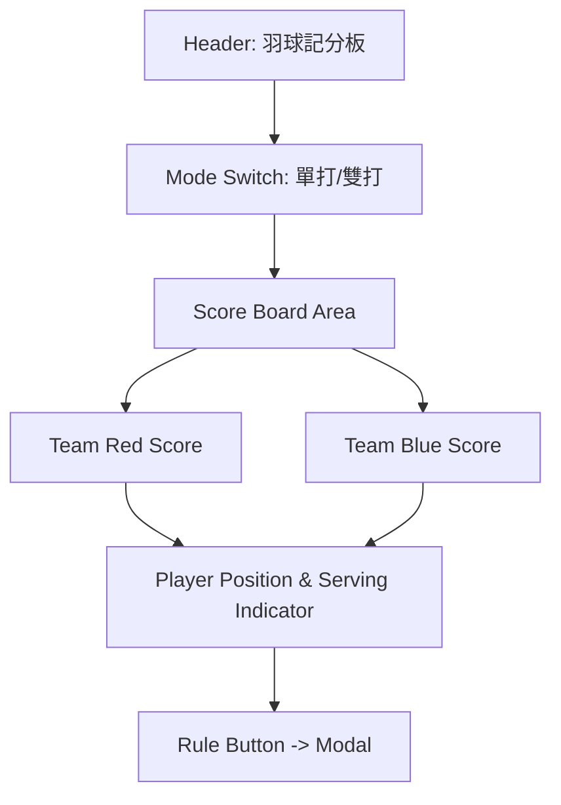

# 羽球記分板開發計畫

## 核心功能需求
1.  **記分功能**：紅/藍兩隊點擊加分，支持撤銷（Undo）上一球。
2.  **規則自動判定**：
    *   **發球權**：根據最後得分方決定。
    *   **站位判定**：
        *   單打：根據發球方分數決定（偶數右、奇數左）。
        *   雙打：根據該隊分數決定（偶數右、奇數左），並正確追蹤 A1/A2, B1/B2 身份。
3.  **規則說明彈窗**：整理使用者提供的文字，以易讀的排版呈現。
4.  **視覺化提示**：在介面上直接標示「目前發球者」及其「站位」。

## 邏輯設計 (雙打)
*   **球員對應**：
    *   初始：A1 站在右，A2 站在左。B1 站在右，B2 站在左。
    *   得分方若原本就擁有發球權：發球員不變，但左右位置交換。
    *   得分方若原本沒有發球權（拿回發球權）：根據當前分數奇偶決定是哪位隊員發球（偶數由站在右邊的發，奇數由站在左邊的發）。

## UI 佈局 (Mermaid)

## 待確認細節 (已根據使用者說明納入)
*   三局兩勝。
*   21 分制，20:20 後須領先 2 分，上限 30 分。
*   11 分換邊。

我已經準備好進入實作階段。
